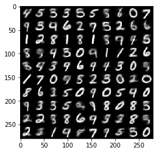
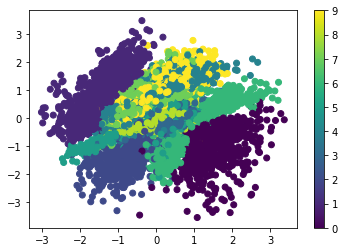

# keras-MMD-Variational-Autoencoder
Keras version of the MMD-Variational-Autoencoder

The author of this [paper](https://arxiv.org/abs/1706.02262) implemented the MMD-Variational-Autoencoder at [here](https://github.com/ShengjiaZhao/MMD-Variational-Autoencoder.git). However, it is written in Tensorflow. What I am doing here is rewriting the code in Keras. It's nothing special, but it could be useful if you prefer Keras to Tensorflow. Besides, you can see the code in colab at [here](https://colab.research.google.com/drive/1-TC8I1MoBBzoWYJk1S-PJIM46mHgv245). 

Here are the results. 

    

    

